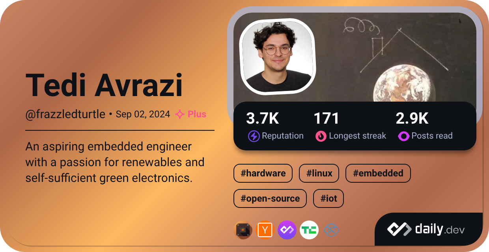

- Hello, I’m @FrazzledTurtle

- Who am I?
    I’m an aspiring Embedded systems engineer with two years of experience in the embedded field, with a knack for optimization and problem-solving. A firm believer in the importance of being a well-rounded engineer capable of addressing diverse challenges that come across my path. My passion lies in hardware engineering, developing firmware using FPGA or System-On-Chips to build complex boards applied in photonics, sound engineering and RF applications. My work has heavily relied in using Linux-oriented embedded systems, and because of that, I've seen what's all the fuss about Linux. Since then, I've migrated all of my personal devices and workflow entirely based on Linux and I am never going back.

- What am I up to?
Currently working as a Linux security engineer by applying security patches to server network infrastructure and hardening Linux Kernels, which I've found being an extremely complex thing to do... 
I am planning to go into the embedded world again, after taking a break from it, by posting some of my personal projects in here. I am focusing on using Rust language in embedded devices to see its potential compared to the traditional way of writing firmware in C.

