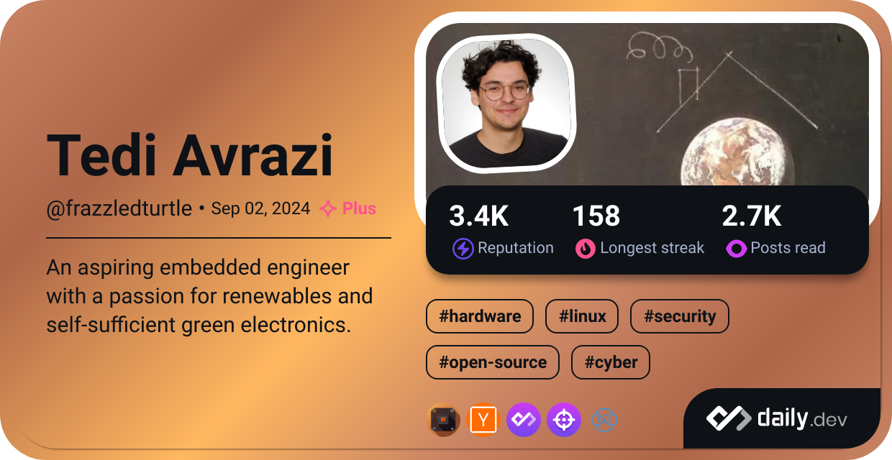

<h2>Who am I?</h2>
I'm an R&D Embedded Systems Engineer with three years of experience designing secure, efficient, and reliable embedded solutions. I specialize in firmware and Hardware Abstraction Layer (HAL) development of microcontrollers and System-on-Chips (SoCs), to create robust hardware–software systems that drive smart technologies in urban environments.
I've engineered industrial-grade devices for applications in photonics, acoustics, and RF systems, along with developing custom test benches tailored to specific hardware validation needs.

My work is driven by the belief that technology should be sustainable, modular, easy to repair, secure, and seamlessly integrated into public life — not hidden in walls or tethered to constant maintenance. I’m passionate about building the future of smart cities through energy-conscious, autonomous, and privacy-aware designs.
  

    

